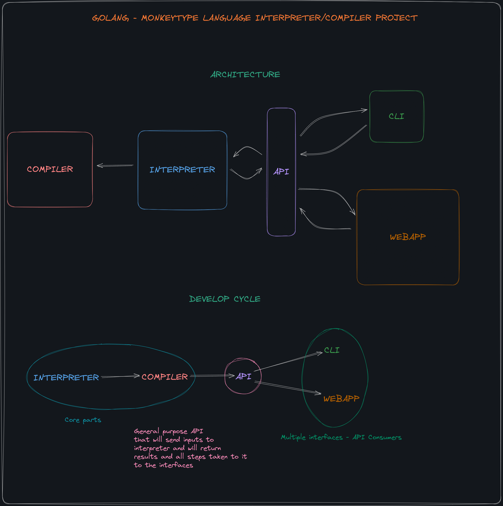

# MonkeyInterpreter
This is a Interpreter for the Monkey Programming Language, presented in the "Writing An Interpreter In Go" by Thorsten Ball

The core parts of the Interpreter will be:

- Lexer
- REPL
- Parser
- Evaluator

This Interpreter is the first part of a multi-part project that I am planning to develop as an personal exercise.

Below you can see a draft of my initial idea

